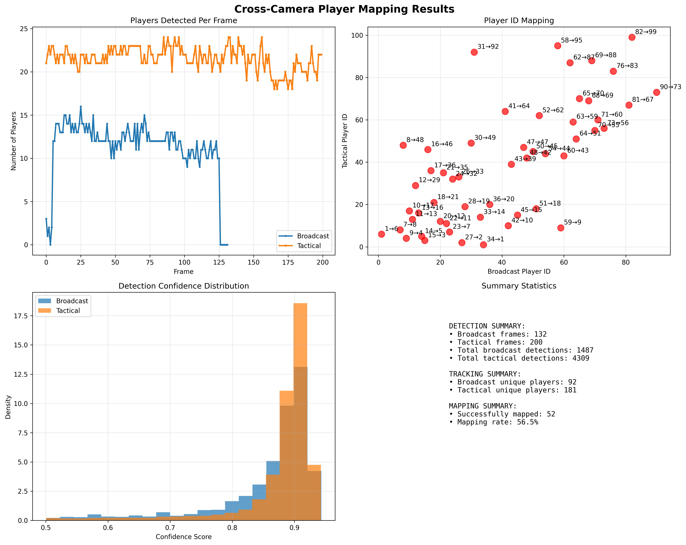

# 🚀 CROSS-CAMERA-PLAYER-MAPPING-USING-YOLO

> Seamless Multi-View Player Tracking Unleashed

[](https://github.com/yourusername/Cross-Camera-player-mapping-using-YOLO/commits/main)
[]()
[]()
[]()

---

## 📚 Table of Contents

- [Overview](#overview)
- [Getting Started](#getting-started)
  - [Prerequisites](#prerequisites)
  - [Installation](#installation)
  - [Usage](#usage)
  - [Testing](#testing)
- [📊 Output Snapshots](#-output-snapshots)
- [🎞️ Sample Video](#️-sample-video)
- [🧠 Features](#-features)
- [📌 Notes](#notes)
- [📬 Contact](#contact)
- [⭐ Acknowledgments](#acknowledgments)

---

## 📖 Overview

**Cross-Camera-player-mapping-using-YOLO** is a developer-focused tool that facilitates seamless tracking and identification of players across multiple camera feeds. By integrating **YOLO-based detection**, **feature extraction**, and **temporal smoothing**, it maintains consistent player IDs across both `broadcast` and `tacticam` views.

---

## 🚀 Getting Started

### 🔧 Prerequisites

- Programming Environment: `Jupyter Notebook`
- Python ≥ 3.8

---

### ⚙️ Installation

Clone the repo and install dependencies:

```bash
git clone https://github.com/sidd707/Cross-Camera-player-mapping-using-YOLO
cd Cross-Camera-player-mapping-using-YOLO
pip install -r requirements.txt
```

---

### 🛠 Usage

Run the main notebook or script:

```bash
python main.py
# OR
jupyter notebook main.ipynb
```

Ensure `model.pt`, `broadcast.mp4`, and `tacticam.mp4` are in the `Assets/` folder.

---

### 🧪 Testing

Test output generation with:

```bash
pytest tests/
```

Or open output visualizations in `/output`:

- `output/mappings/player_mapping_results.png`
- `output/mappings/mapping_summary.html`

---

## 📊 Output Snapshots

### 📈 Player Mapping Result



### 🧭 Trajectory Plot


---

## 🎞️ Sample Video

Here’s the output video where players retain consistent IDs across views:

[▶ Watch mapped_video.mp4](output/mapped_video.mp4)

> 🎯 Each player is labeled identically in both `broadcast` and `tacticam` views using unified `player_id`.

---

## 🧠 Features

- ✅ **Object Detection & Feature Extraction**  
  Uses YOLO for real-time player/ball detection and visual embedding.

- 🔄 **Temporal Smoothing**  
  Ensures stable IDs over frames and reduces flicker.

- 🔍 **Multi-View Mapping Summaries**  
  Generates both textual and visual summaries for validation.

- 🔁 **Cross-Camera Tracking**  
  Maintains identity across camera angles using spatial and visual similarity.

- 📊 **Visual Output Reports**  
  Produces `.html`, `.png`, `.csv`, and `.mp4` outputs.

---

## 📌 Notes

- YOLOv11 model (`model.pt`) is fine-tuned specifically for player and ball detection.
- Results saved in `/output/mappings/` and `/output/Tracks/`.
- Does **not** depend on jersey numbers or pose models.

---

## 📬 Contact

For improvements or collaboration:

- 🔗 GitHub Issues: [Report bugs or suggestions](https://github.com/sidd707/Cross-Camera-player-mapping-using-YOLO/issues)
- 💼 LinkedIn: [Your Profile](https://linkedin.com/in/your-profile)

---

## ⭐ Acknowledgments

- [Ultralytics YOLO](https://github.com/ultralytics/yolov5)
- Inspired by research in sports analytics and computer vision.

---
